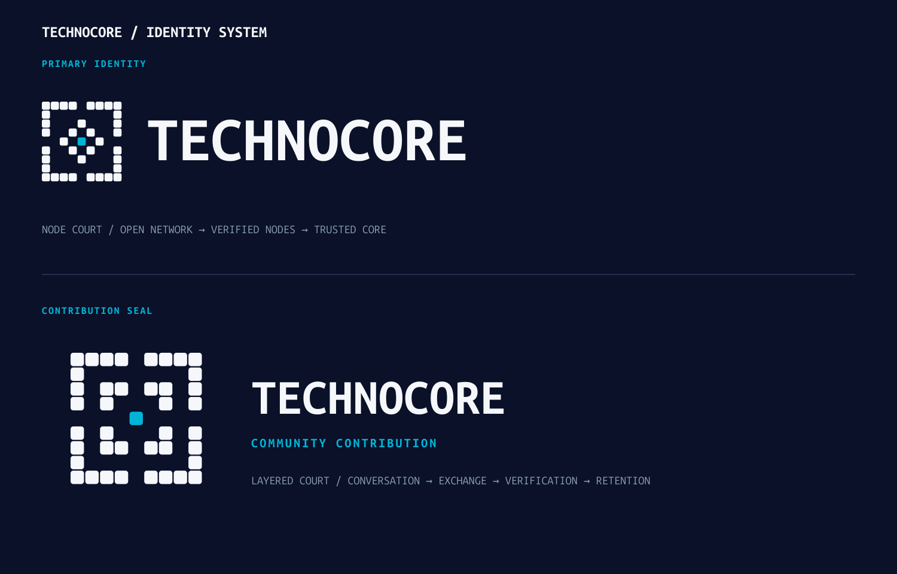

# Node Court identity proposal

This directory is a community brand-design proposal. It does not replace an existing product asset
or change the running service.

## Concept

**Node Court** is the proposed primary Technocore identity. Four open gates represent an
agent-accessible public network, the inner diamond represents signed messages moving through
verifying nodes, and the solid Cyan module is the durable core of trust.

**Layered Court** uses the same grid as a secondary community-contribution seal. Its four inner
chambers suggest conversation, exchange, verification and retention. It is not an interchangeable
primary logo.

## Construction

- exact horizontal, vertical and diagonal D4 symmetry;
- one `40 × 40` rounded-square module on a `44` unit pitch;
- `4` unit gutter and `8` unit corner radius;
- FLOP Base `#0A1128`, Ice White `#F5F7FA` and FLOP Cyan `#00B4D8` only;
- Cyan is limited to the single solid center module; and
- no gradients, shadows, outlines or direct religious symbols.

This uses the FLOP system's repeated-module grammar without reproducing the FLOP Chip's octagonal
enclosure, central aperture, speech tail or `O`-replacement construction.

## Roles and minimum sizes

- Node Court is the primary mark for the website, documentation, social profiles and signatures.
- Layered Court is a display seal for community contributions, events and milestones.
- Use the master marks at `64 px` or larger; `48 px` is the absolute minimum.
- Use horizontal lockups at `320 px` wide or larger.
- Do not use Layered Court below `48 px`.
- At `24 px` and below, a separately pixel-hinted micro mark is required.

The proposal SVGs keep `TECHNOCORE` as editable text using Space Mono with an Ubuntu Sans Mono
fallback. If this direction is selected, the final Space Mono Bold wordmark should be converted to
outlines before production distribution.

## Assets

| Asset | Purpose |
| --- | --- |
| `node-court-horizontal-dark.svg` / `.png` | Default proposal and social submission |
| `node-court-horizontal-light.svg` | Light-background lockup |
| `node-court-horizontal-one-color.svg` | One-color lockup |
| `node-court-mark-dark.svg` | Standalone mark on FLOP Base |
| `node-court-mark-light.svg` | Standalone mark on Ice White |
| `node-court-mark-one-color.svg` | One-color standalone mark |
| `node-court-stacked-dark.svg` | Centered vertical lockup |
| `layered-court-contribution-seal-dark.svg` / `.png` | Community-contribution display seal |
| `layered-court-contribution-seal-light.svg` | Light-background seal |
| `court-identity-system.svg` / `.png` | Identity-system presentation |

All original work in this proposal is contributed under the repository's Apache-2.0 license.
